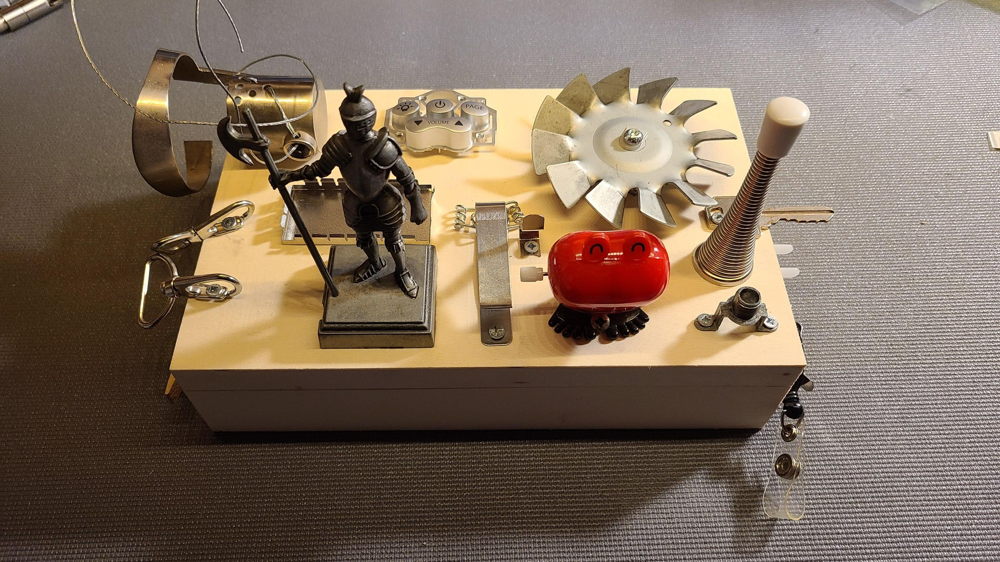

# Noise Box

Using a piezo contact mic + amplifier, create a noise box.

Begin with a resonant chamber, which might be a found object (box, can, etc) or constructed from cardboard or wood. Mount your piezo disc inside the chamber.

Augment the chamber with noisemakers. Ideas:
- rice, dried beans, BBs, ball bearings, small beads sealed inside compartments
- threaded rod; zippers; cheese graters; files/rasps; corrugated cardboard edges
- rubber bands in assorted widths; guitar/piano strings
- Bobby pins; hair clips; paper clips; combs
- etc

Source noisemakers from wherever you can. Receipts from Hamshaw (150 College Street) will be reimbursed up to $15.

