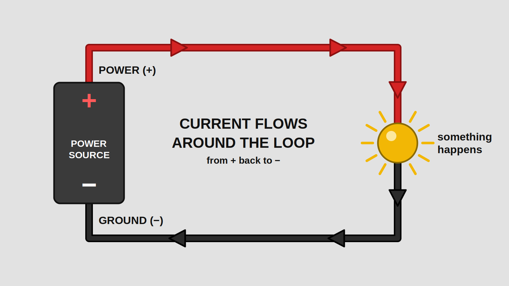
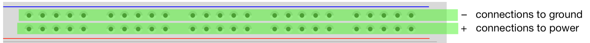
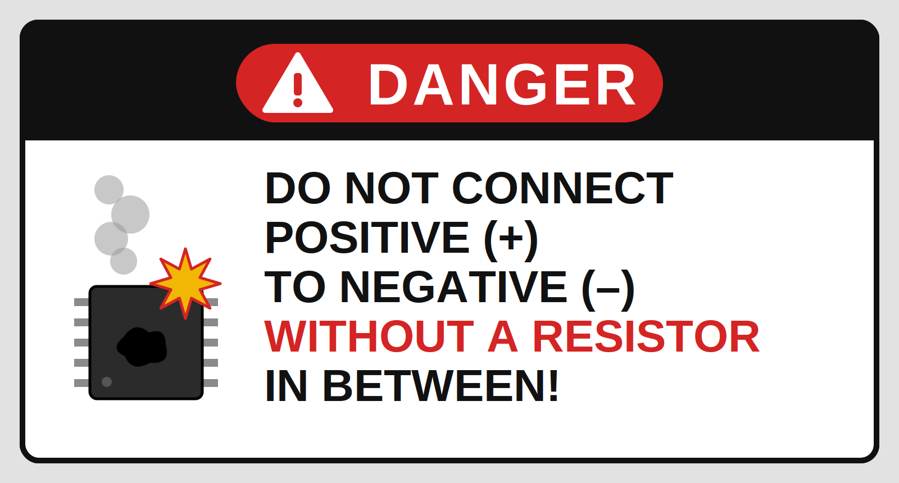
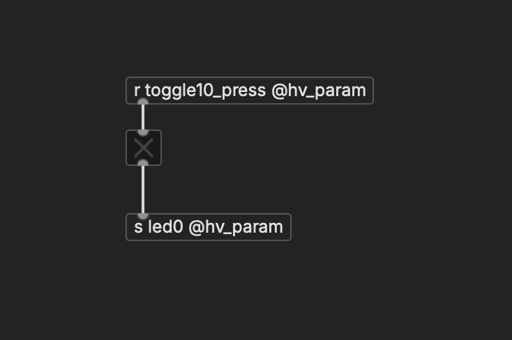
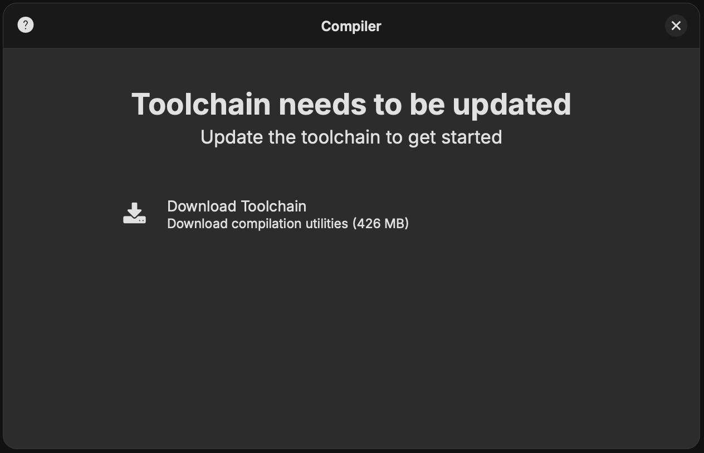
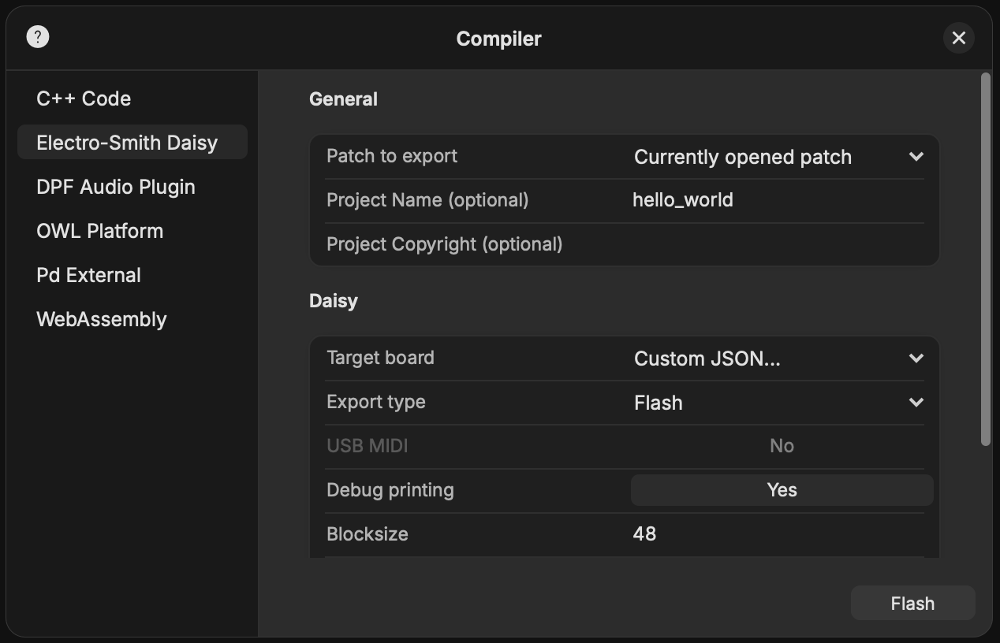
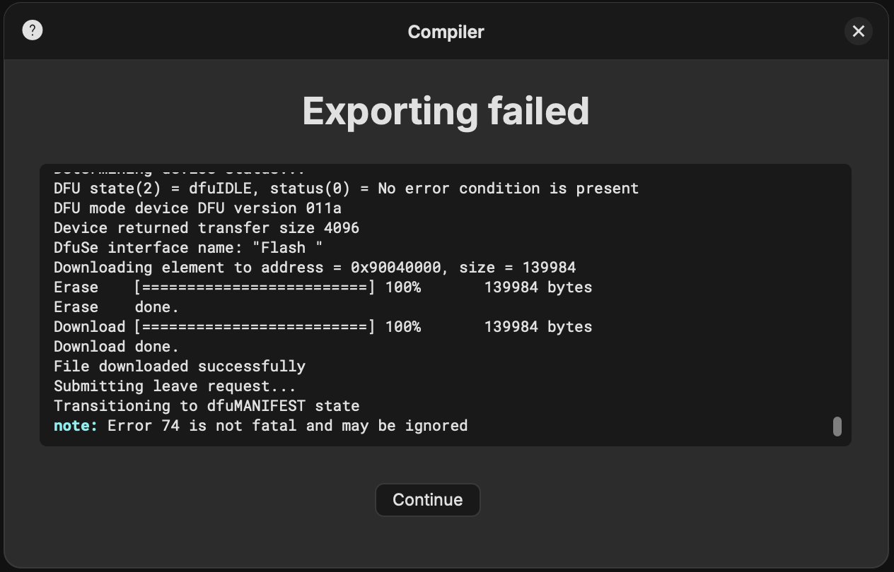
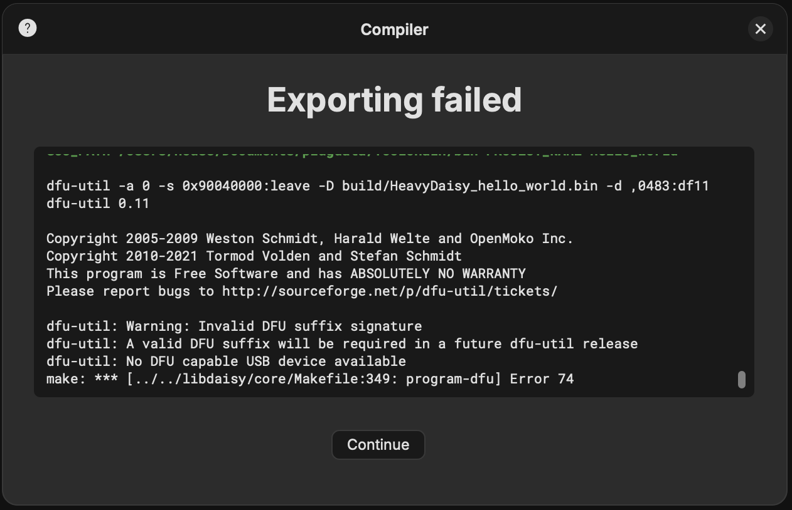
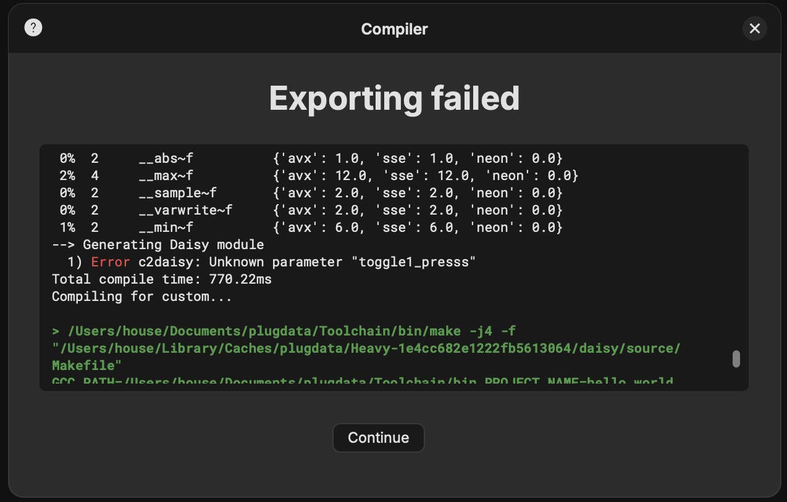
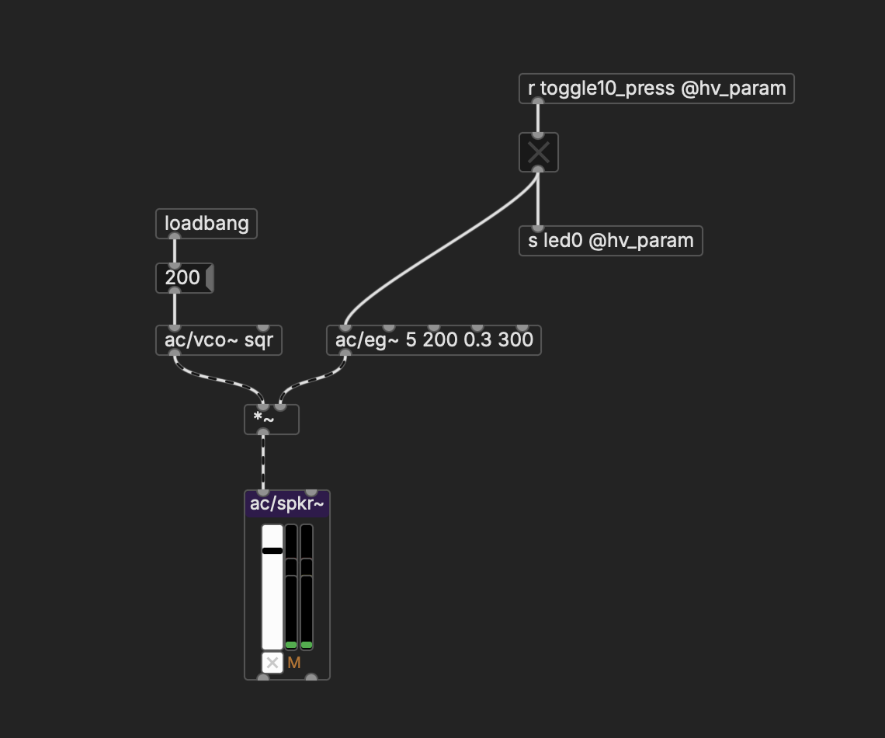

# Getting started with the Daisy Seed

## Microcontrollers

The Daisy Seed is a microcontroller designed for audio.

A microcontroller is, in essence, a computer. The primary difference is that a computer is a general purpose machine with an operating system (like MacOS or Windows) that runs multiple programs, but a microcontroller only runs one program, its "firmware". The Daisy Seed is particularly awesome because we can use Pd patches as firmware.

What's the advantage of using a microcontroller over a computer? Rather than being contained within a sleek box with a monitor and keyboard, it can be integrated into an electrical circuit that includes other hardware components, like sensors and amplifiers. As artists and musicians, we can use this to make our own custom interfaces that go well beyond what is possible with pre-made systems.

    

## Circuits

According to the dictionary, in the general sense the word circuit means "a roughly circular line, route, or movement that starts and finishes at the same place." That applies in the electrical sense, too. A circuit is a loop in which electricity is flowing from "power" back to "ground" and making something happen along the way. We typically use `+` (power) and `-` (ground) to indicate which side of the circuit we're on.

    

### An aside for analogies

`Current` is the amount of electricity that is flowing through the circuit. `Voltage` is the "pressure" at any given point. `Resistance` releases some of that pressure (as heat — it's slightly misnamed IMO, should be more like "Dissipator"). This gives us Ohm's law: Current = Voltage / Resistance.

This is nicely analogous to the longitudinal waves of sound, in which oscillating pressure changes in the air are what we hear. The shape of those waves is like voltage; how much air is moving is the current.

Likewise, in audio, voltage fluctuations correspond to the _shape_ of the sound. "Sound waves" → "electrical waves" might be one way to think about it. An amplifier makes them bigger; ripples become tsunamis (which uses more air, hence more current), but it's the same signal. A speaker physically converts those voltage fluctuations back into air pressure.

In Pd, the "signal" connections are also analogous to sound / voltage; they are "waves" between -1 and 1 that flow through your objects.

However, most of what we'll do with the Daisy Seed is more like the "control" connections of Pd. In this case, the voltage isn't oscillating like a wave—it's set at constant values that mean something, like if a toggle is on or off, or a slider is set at a particular position. This is where resistance comes into play. Using resistors (which is what a button, knob, or sensor is from an electrical perspective), we can change the voltage at various places in our circuit, measure the result, and use that as data within Pd.

## Pins

The legs of the seed are connection points, called pins.

The diagram below is a "pinout" diagram that shows which is which. Most of these pins are, in essence, sensors that can measure voltage. We can receive the values from these pins in our Pd patches to control buttons, toggles, and sliders. "Digital" pins (color) only work for detecting "on" and "off"; ie, buttons and toggles. "Analog" pins (color) can be a range; sliders.

In addition, there are some special pins:
- stereo audio output (L OUT, R OUT)
- stereo audio input (L IN, R IN)
- MIDI in and MIDI out
- SDL and SDA (data connections)
- battery connection
- power  `+`
- ground `-`

    

So how do we actually make connections?

## Breadboards

While we can make permanent circuits by soldering on "perf" boards, it's much easier to experiment using breadboards.

Breadboards are awesome because they let us work through our circuit ideas quickly and reward experimentation. Wires can sometimes pop loose, but that's a small price to pay for not having to undo soldered connections to change something.

The following image shows how breadboards create hidden connections between their holes—you can connect components together simply by plugging them into adjacent holes, according to this scheme:

    

As a result:

    

### Power Rails

Those long strips of connected holes on the top and bottom of the breadboard are called "power rails." We'll set things up so that `+` runs through the red strips and `-` runs through the blue/black ones. This gives us lots of points to connect to power and ground.

    

### Shorting

There is basically only one rule when we make connections. And that is that when we create a circuit, it must include some kind of resistance to limit the amount of current that can flow. So don't connect `+` directly to `-`. Otherwise ... BOOM. Fried chip. 

    

## Breadboard setup

Put the seed on the breadboard like in the image below. Pushing the pins into the board can feel a bit scary, be careful but firm.

    

Notice how both power and ground pins are connected to the approprimate strips on the power rail. We also have two wires that run across the board so that both rails are connected to each other. As a convention, I use red wires for connections to `+` and black for `-`.

For now, BAT isn't connected to anything—our power source will be the USB jack, so we won't use a battery.

This will always be our basic starting point when wiring things up with the seed. Note that the numbers and letters on the breadboard don't matter, so don't get confused when we talk about the pins on the seed—the ones in the diagram above are what we're referring to.

## Hello World

### Simple interface circuit

Starting with our basic setup, we can begin to attach other elements. To begin with, let's add a button:

A button (or "momentary switch") has two sides, each with two pins. When you press the button, everything is connected together. Notice that one side is connected to a pin (I use green wires for measuring connections), and the other side is connected to `-`. I used pin 10. No relation to the breadboard number which happens to be right next to it, you have to count the pins on the seed itself and follow the pinout diagram.

In this most basic case, all the pin is measuring is whether it's connected to ground or not. That's why we don't even use a `+` connection.

So how do we use this?

### Pd patch

In Pd, open a new patch. Create a toggle. Going into the toggle will be the output off our button. We get that by creating a new object and calling it (bear with me) `r toggle10_press @hv_param`.

Coming out of the toggle will be another object, `s led0 @hv_param`. This one controls one of the LEDs on the seed.

    

Now choose "Compile" under the main menu. You should be prompted to install or update your "toolchain" if you haven't already. Go ahead and do this.

    

Then you'll get to the compiler window. Make sure you have "Electro-Smith Daisy" selected, and for the target board, choose "Custom JSON". This should open a dialog box, where you'll select [compile.json](compile.json) that you've downloded from github via Moodle.

    

Plug in your seed. Notice that it has two buttons, "boot" and "reset" (very small type). 

1. Press and hold the Boot button
1. Press and release the Reset button
1. Let go of the Boot button

Now you're ready. Click Flash and cross your fingers. 

If it works, you'll see this (misleading, I know):

    

...but if you get this message, your seed isn't connected properly or you haven't done the button thing correctly:

    

Anything else means there's something wrong with the patch. Scroll up in the error panel until you see the actual error, which may give you a clue:

        

If all goes well, push the button. You should see a light on the seed turn on.

### Adding audio

Expand your Pd patch to include a simple oscillator controlled by a button. Something like this:

        

Note the use of `loadbang` to initialize the oscillator; your patch should work without any extra mouse clicks that aren't connected to an `@hv_param` seed object. Check that it works well on your computer by closing the patch and opening it again. Then repeat the steps above to flash it to your seed.

To hear it, we're going to need to connect something to `L OUT` on the seed. The most straightforward option is to use a 1/4" mono audio jack—aka, a plug for a guitar cable.

- prepare the jack (use stranded wire)
- connect to the seed
- plug into the amp

Turn it on and boogie

