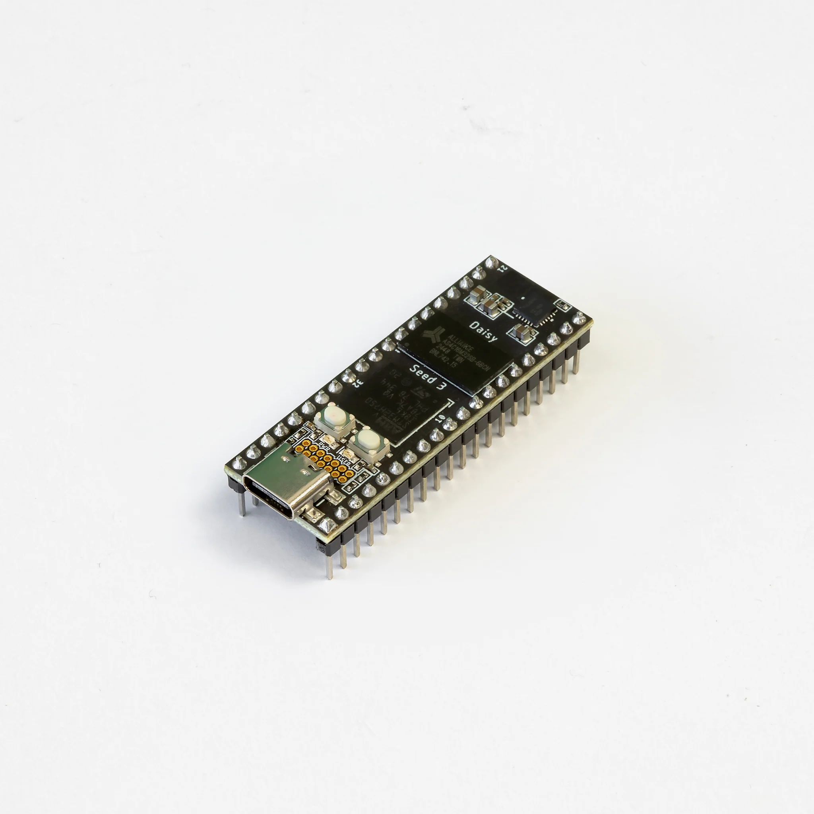
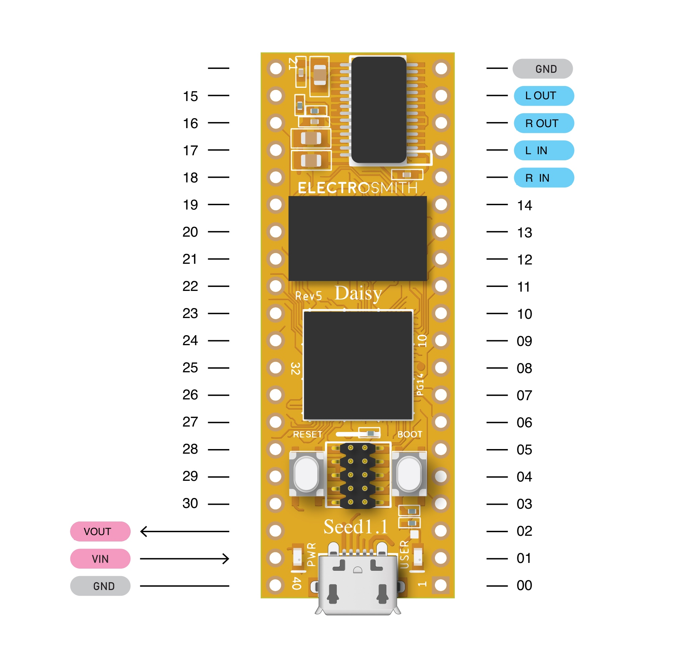
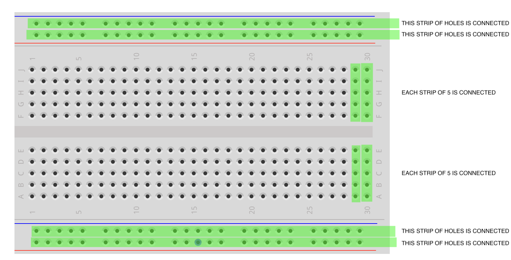
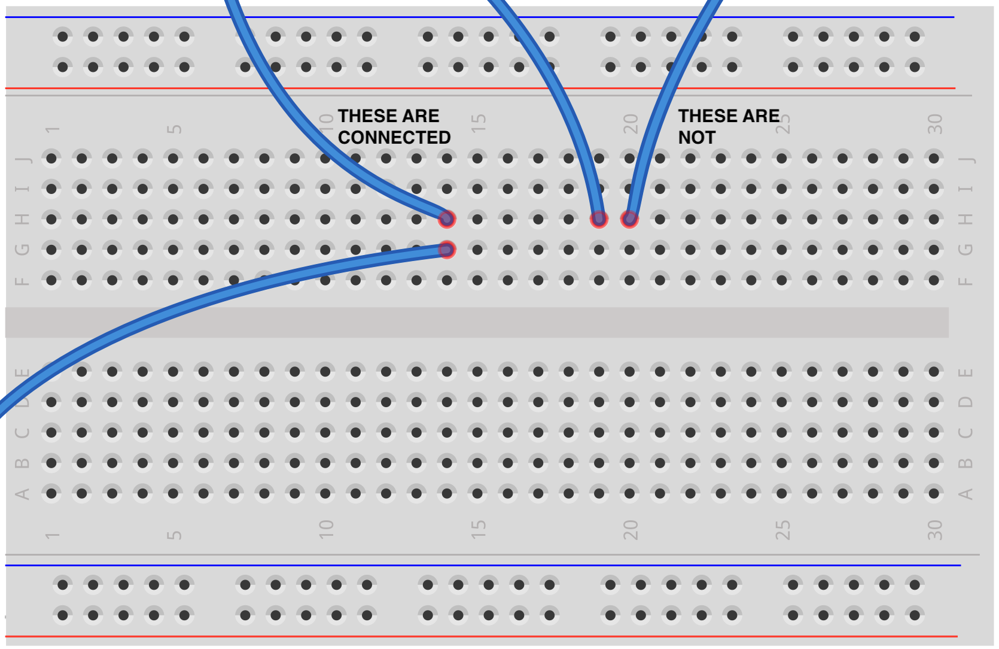
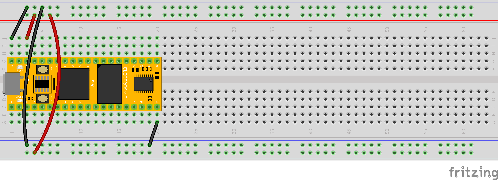

# Getting started with the Daisy Seed

## Microcontrollers

The Daisy Seed is a microcontroller designed for audio.

A microcontroller is, in essence, a computer. The primary difference is that a computer is a general purpose machine with an operating system (like MacOS or Windows) that runs multiple programs, but a microcontroller only runs one program, its "firmware". The Daisy Seed is particularly awesome because we can use Pd patches as firmware.

What's the advantage of using a microcontroller over a computer? It can be integrated into an electrical circuit that includes other hardware components, like sensors and amplifiers. As such, rather than being contained within a sleek box with a monitor and keyboard, a microcontroller has its parts exposed so that circuits can be built around it. As artists and musicians, we can build microcontrollers into our own custom interfaces that combine basic parts into forms that go well beyond what is possible with pre-made systems.

    

## Circuits

According to the dictionary, in the general sense the word circuit means "a roughly circular line, route, or movement that starts and finishes at the same place." That applies in the electrical sense, too. A circuit is a loop, or rather, it's typically a whole knot of loops, in which electrical current is flowing from "power" back to "ground" and making something happen along the way. Between power and ground, we use positive (+) and negative (-) to indicate the direction of the flow. 

When it comes to audio, we can also think of the flow of current in terms of an audio signal. For example, an amplifier takes an audio signal, boosts it with additional current, and then sends it out to a speaker, which transduces that current into physical motion in the air.

When we're working with the Daisy Seed, we're going to be making circuits that run from power to ground through its various "pins" and external components like switches and LEDs.

## Pins

So what are pins? They are the connection points on the seed, the legs to which we can attach electrical components to make circuits. The diagram below is a "pinout" diagram that shows which is which. There are pins to connect stereo audio output (L OUT, R OUT) and input (L IN, R IN), a power source (VIN), a power supply (VOUT), and connections to ground (GND). The rest of the pins are general purpose pins for buttons, switches, etc.

    

To begin, we're going to set things up for prototyping on a breadboard.

## Breadboards

While we can make permanent circuits by soldering on perf boards, it's much easier to experiment using breadboards.

Breadboards are awesome because they let us work through our circuit ideas quickly and reward experimentation. Wires can sometimes pop loose, but that's a small price to pay for not having to undo soldered connections to change something.

The following image shows how breadboards create hidden connections between their holes—you can connect components together simply by plugging them into adjacent holes, according to this scheme:

    

As a result:

    

### Power Rails

Those long strips of connected holes on the top and bottom of the breadboard are called "power rails." We'll set things up so that power runs through the red strips and ground runs through the blue/black ones. This gives us lots of points to connect to power and ground.

## Setup

Put the seed on the breadboard like in the image below. The numbers and letters on the breadboard don't matter, so don't get confused when we talk about the pins on the seed—the ones in the diagram above are what we're referring to.

    

Notice below how both ground pins are connected to grounds on the power rail. VOUT feeds power to the rail, and then we have two wires that run across the board so that both rails are connected to each other.

For now, VIN isn't connected to anything—our input source will be the USB jack.

This is the basic starting point. From here, we can begin to attach other elements. To begin with, let's add a button:

## Hello World

In Pd, open a patch, and choose "Compile" under the main menu. You should be prompted to install or update your "toolchain" if you haven't already. Go ahead and do this.

