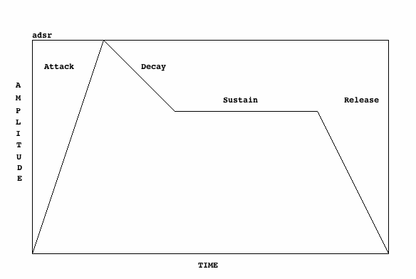
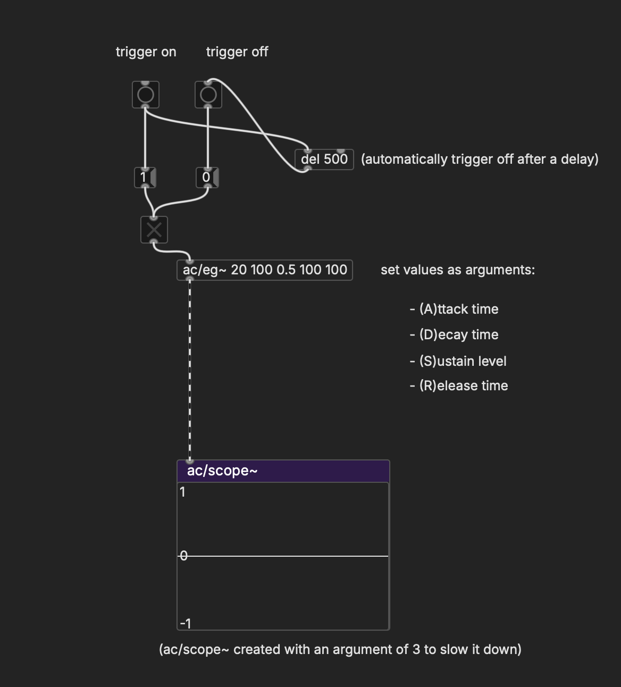
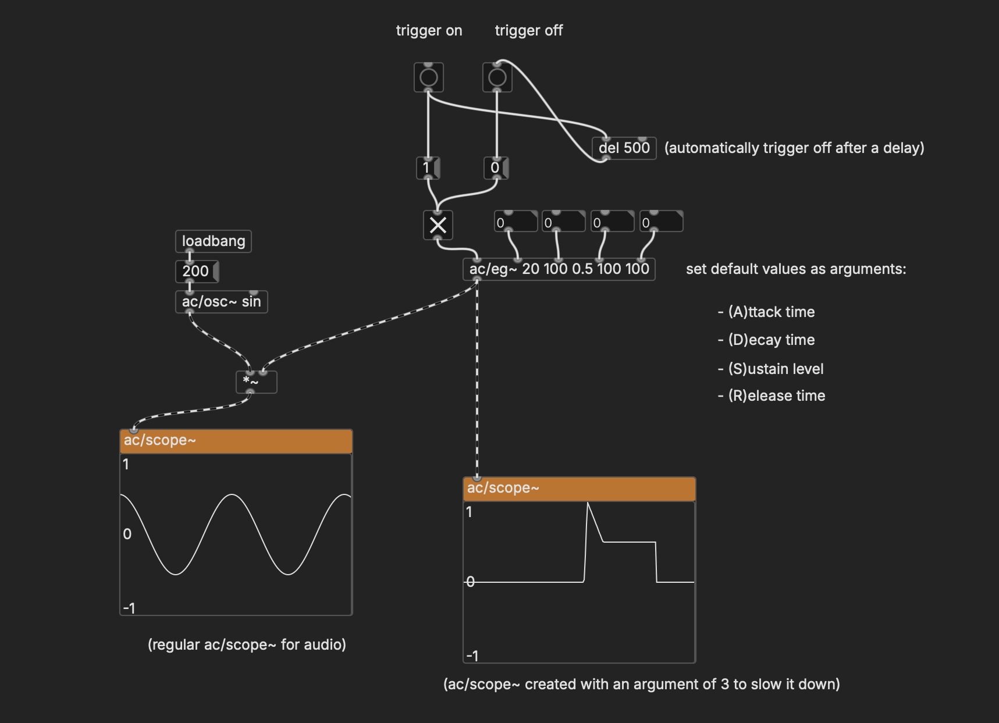
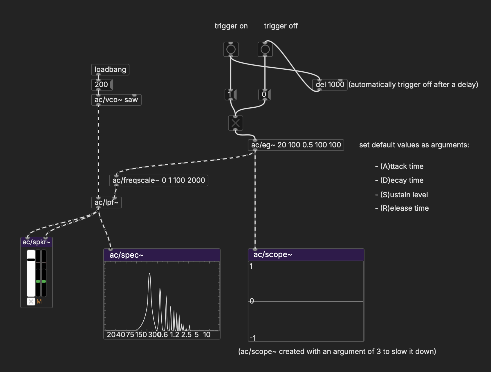
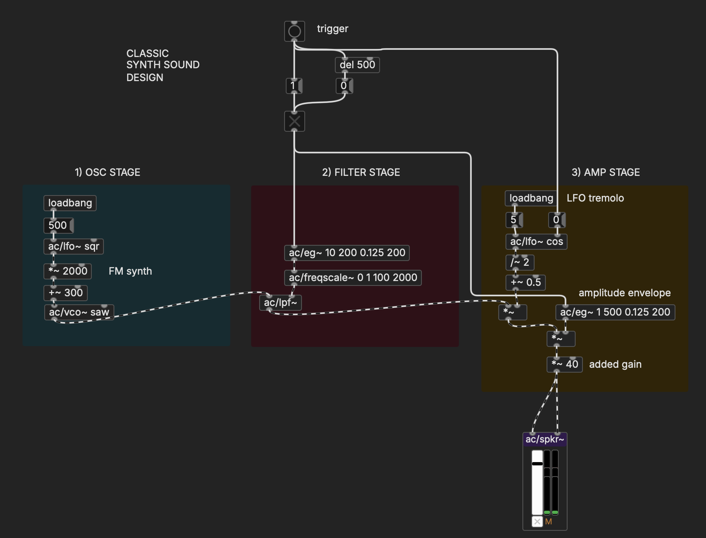

# Envelopes

But sound events in the physical world don't just sound continuously, they have a shape to them. There might be an initial strike, tone, or impact, followed by a quieter section as a vibrating body comes to rest. The timbre might also start off with one character and transition into another. So let's see what we can do with **envelopes**.

## Envelopes

The most typical configuration for an envelope, which you'll see all over the place on synthesizers and software instruments, is a four-stage function known as an ADSR:

   

- **(A)ttack**: the length of time it takes the sound to reach its loudest point after it is triggered
- **(D)ecay**: the length of time after the attack it takes the sound to reach its sustain amplitude
- **(S)ustain**: the amplitude that the signal is held at after the initial decay
- **(R)elease**: the length of time it takes the sound to fade to silence after it is released

You can think of triggering a sound and subsequently releasing it as analogous to pressing down an organ key, holding it for an arbitrary length of time, and then letting it go. 

In Pd, we can define an envelope with the `ac/eg~` object (**e**nvelope **g**enerator):

   

Note that `ac/eg~` takes a `1` to trigger the envelope and a `0` to release it. On its own, this does nothing—it just gives you the envelope as a signal to work with.

## Amplitude envelopes

But by multiplying some oscillating signal with the `ac/eg~` signal, we can produce discrete sound events with very different characters. Experiment with how each parameter changes the sound.

   

## Filter envelopes

Another common use for an envelope is to control the rolloff frequency of a filter. In this example, we're using `ac/freqscale~` to rescale the 0-1 range of the envelope to a frequency range of our choosing. This results in a filter sweep over the static tone. 

   

For this, you'll want to have a wave with lots of harmonics like a saw or square wave (or something more complex) as opposed to a sine wave, which won't have much to filter out.

## Sound design with envelopes

The classic setup that hardware synthesizers use for sound design has three stages:

1. **OSCILLATOR STAGE** Create an interesting waveform by combining oscillators
2. **FILTER STAGE** Apply an enveloped filter to change the timbre over time
3. **AMPLIFIER STAGE** Shape the sound with tremolo, an amplitude envelope, and any added make-up gain

   

Each of these sections can be as simple or elaborate as you want it to be, and of course you by no means have to organize things in this way. To some extent, this design was motivated by hardware constraints that we don't have in Pd. That said, having a conceptually organized approach like this can be very helpful.

One detail: note that we reset the phase of the LFO when the note is triggered. This synchronizes the tremolo with the beginning of the envelope.

