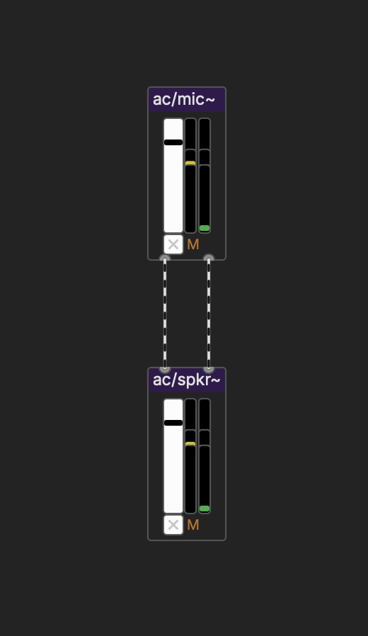
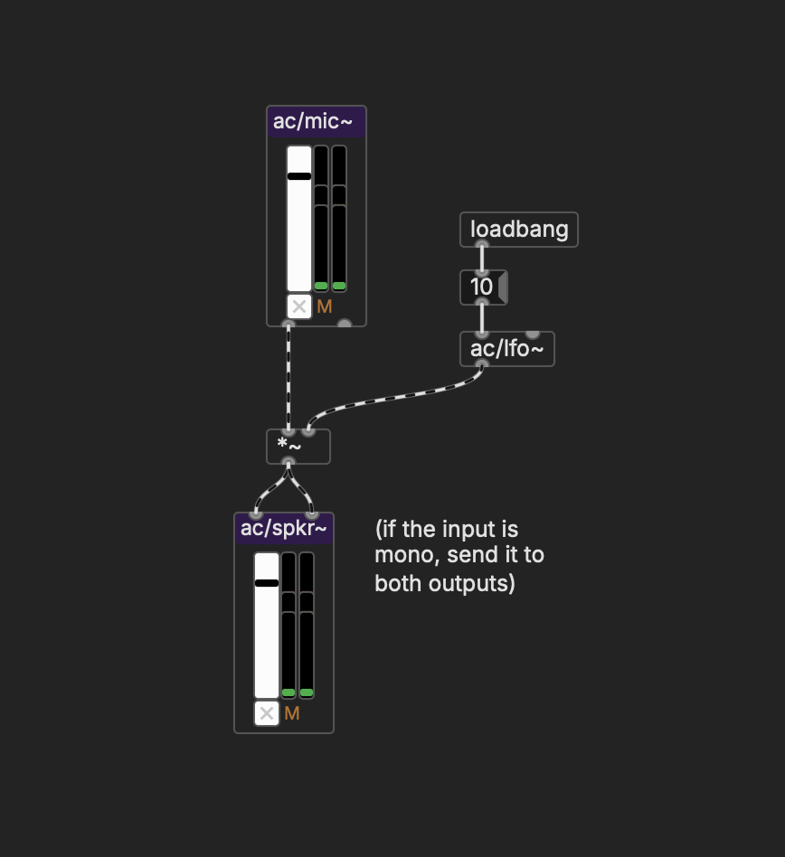
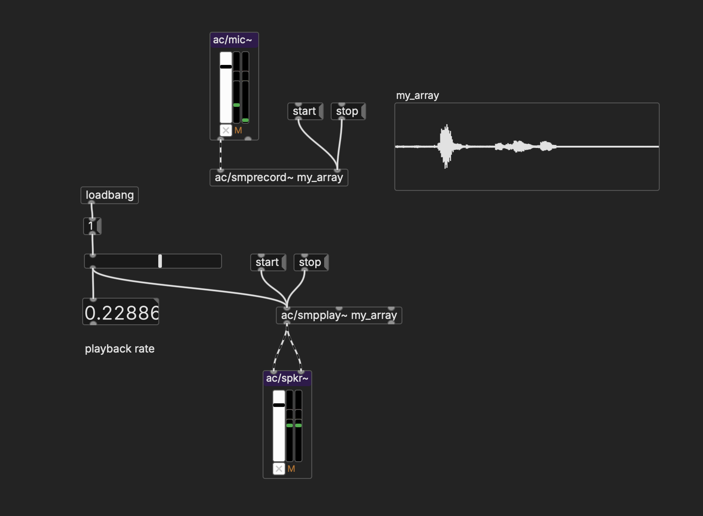
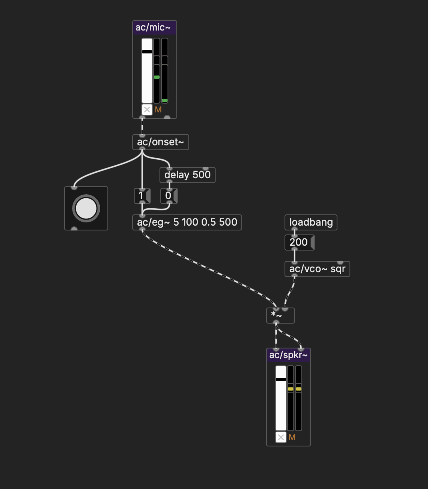
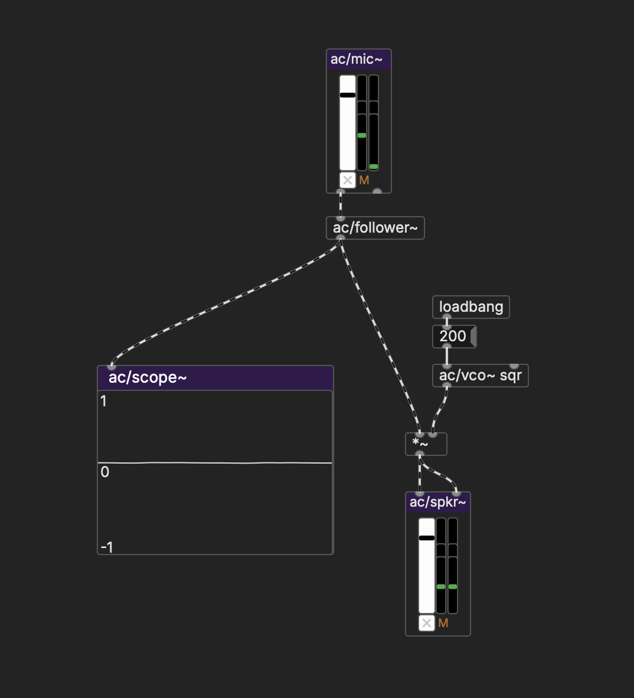

# Live Input

Now that we can use real-time systems to synthesize sounds, manipulate samples, and sequence and spatialize how audio changes through time, our Pd toolkit is almost complete. The last thing we'll cover is using other forms of input, starting with audio.

## Live audio signal

In Pd, create an `ac/mic~` object. This looks strikingly like `ac/spkr~`, except it goes in the opposite direction: instead of inlets, there are two outlets for the left and right channels. Make sure your DSP and Audio are turned on. If you're using your laptop microphone, you should see audio activity in the meter of `ac/mic~`. If you raise the slider, you'll get audio flowing out of one or both of the outlets, depending on whether your input device is mono or stereo. You can connect it directly to an `ac/spkr~` to test, although look out for feedback if you aren't using headphones.

   

From here, you can process the audio live through any of the familiar techniques we've used. To keep things simple, you may just want to work with one channel. Adding live tremolo:

   

## Sampling

In the previous exercise, we manipulated audio samples that we had prepared in Audacity. However, now that we have live input, we can sample from the microphone directly in Pd.

To do this, we'll use `ac/smprecord~`, which takes the name of an array as an argument. This object receives a signal, and by sending it a "record" message, it writes the incoming signal into the array:

   

Note that the maximum recording time is determined by the number of samples that you set in the properties of your array.

## Controlling parameters with audio

Audio input can also be useful not only as a source of audio data, but as a means of triggering events in your patch.

To treat an audio signal in this way, we can use the `ac/onset~` object. `ac/onset~` performs a calculation on the incoming signal to detect whether an "onset" has occurred—ie, the a sudden increase in the signal, like going from silence to noise. If this happens, it outputs a bang.

Hooking `ac/onset~` up to an envelope generator, for example, can make a voice-triggerable synth note play:

   

Similarly, `ac/follower~` tracks the amplitude of an audio signal. It outputs a signal between 0 and 1 (if you want decibels, use `ac/dbpeak~`). This way, you can hook `ac/follower~` up wherever you might use an LFO or envelope, multiplying it with an audio signal to create an amplitude envelope for another signal:

   

