## Pure Data / plugdata = Pd

There are many ways that artists and musicians have produced electronic sound, from hardware modular synthesizers like those produced by Moog and Buchla to software platforms like Ableton or MainStage.

We're going to be using a visual control-flow programming language. Unlike most programming languages, this type of programming doesn't use code per se, but a graphical layout of functions and operators. It's a common approach for working with multimedia, including languages like vvvv, Isadora, and Quartz Composer. Max/MSP is the first and most influential of these, which was originally developed by the researcher Miller Puckette and now powers the effects in Abelton Live. After Max became a commercial product, Puckette created a free and open-source version called Pure Data, or Pd. Plugdata is a community rewrite of Pd with a better user interface—and support for compiling to hardware. So plugdata is what we will use to build our sounds and power our instruments.

We could do the exact same thing with electronics, store-bought modules, or pre-made software, but this approach demonstrates the fundamentals (and it's free). In addition, Pd can not only run on your computer, but phones and electronic devices, so it's used to make effects for those as well.

### Installation

Download Pd here: https://plugdata.org

Once you have launched the application, but before we do anything with it, we need to do one more thing, which is to add a set of "externals" to the system. Download those here by clicking "Code" and choosing "Download Zip": [https://github.com/brianhouse/ac](https://github.com/brianhouse/ac). Navigate to your "Documents" folder, which should now contain a "plugdata" folder. Inside "plugdata", there should be another folder called "externals". Drag your .zip file inside the externals folder. Now extract the .zip so that you have a folder called "ac" inside "externals" inside "plugdata" (and then delete the zip).

  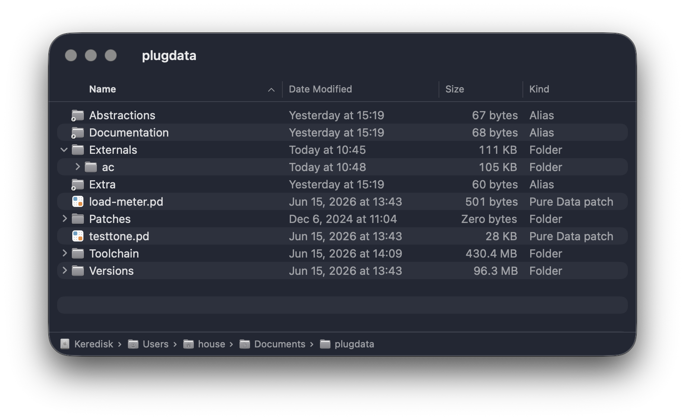 

Now, back in Pd, to make sure our audio is up and running, select "☰" in the upper left of the screen to get the menu and select "Settings..." Under the Audio tab, click "Test" to make sure the audio is working as you'd like it.

  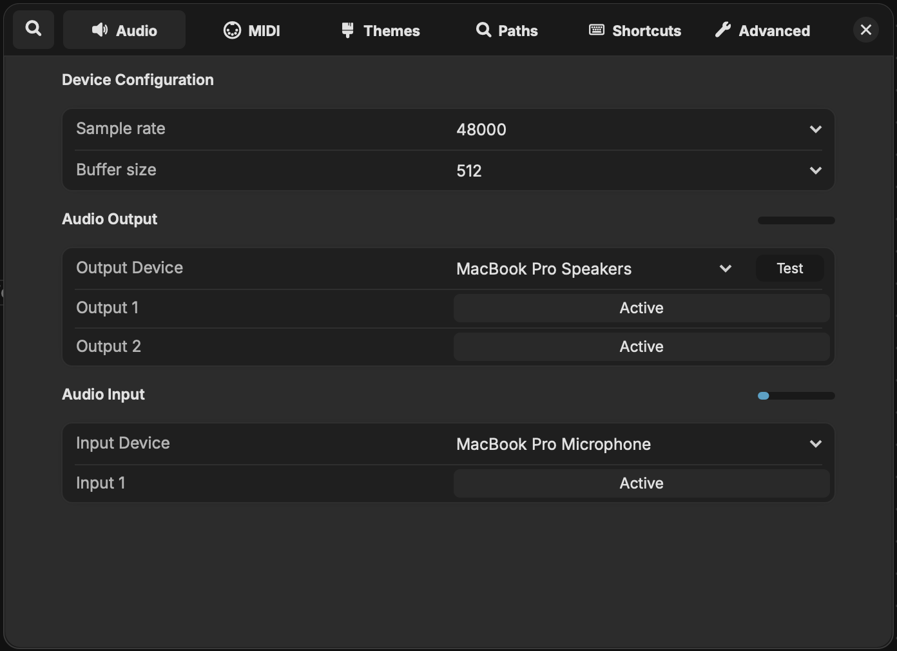 

Finally, under the menu, there is a checkbox for "Compiled mode". Make sure this is checked. It will restrict the capabilities of Pd to what is possible to compile for our hardware chips—turning it on now simplifies things for us now and sets us up for what we'll need to do down the line.

  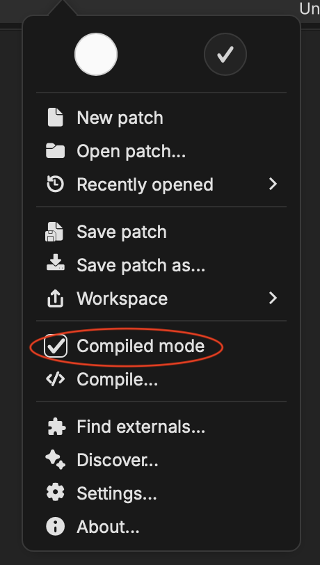 

Ok! Now we're set up and good to go.

## Basic principles of Pd

### Placement

A blank patch is both intimidating and filled with possibility. Type Command/Control-1 (or double-click) and you will see an empty box where you can type the name of an object:

  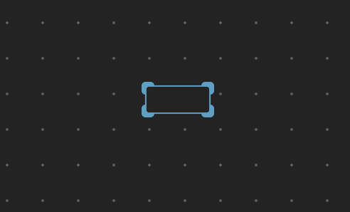 

Objects are the "vocabulary" of Pd. As you learn the names of objects, you will be able to make patches with more complexity. If you type the word "print" inside this object and click again outside the box, you will create the [print] object.

Next, let's create a Number using Command/Control-3. Put it above `print`. Note that it has a little wedge in the corner that distinguishes it as a number box.

  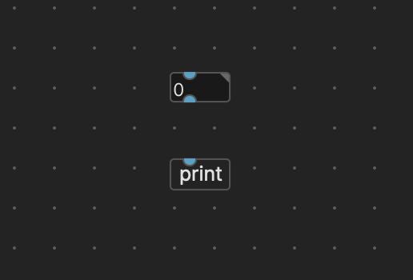 

### Connections

Note the blue tabs on the boxes, one on the top of `print` and one each on the top and bottom of `number`. These are connection points. If you put your cursor over the bottom "outlet" of the Number box, you can click and drag it to the "inlet" on the top of `print` to make a connection.

  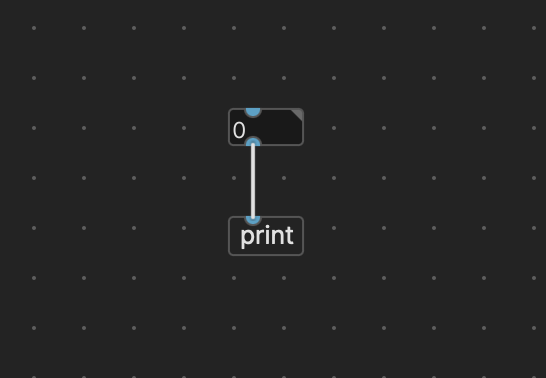 

### Switching between Edit and Playback mode

Notice that the patch has a grid of dots on it, and that the "pencil" icon in the top middle of the screen is highlighted. This means that we are in edit mode, and our mouse clicks are interpreted as intending to alter the patch. To change to playback mode, choose the pencil with the line through it, type Command/Control-E, or simply Command/Control–click on the patch. The dots will disappear and you can no longer make connections between boxes.

Once you're in playback mode, click on the Number box and drag your mouse up and down.

  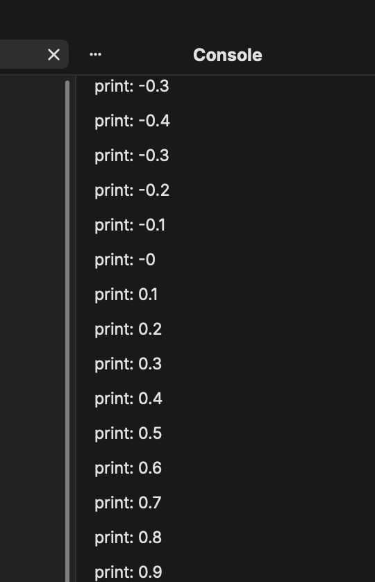 

This simple setup demonstrates the fundamental way that Pd and all control flow programs work. The number produced by the number box as it is moved up and down is sent through the connection to `print`, which displays it in the log.

Now, make a Message using Command/Control-2. Messages can be numbers, or they can be text ("symbols"), but they can't be changed with the mouse like Numbers can. Once again, Messages are distinguished from other types of boxes by a different shape on the right. Attach it to print, switch from edit mode to playback mode, click it, and look at the log.

  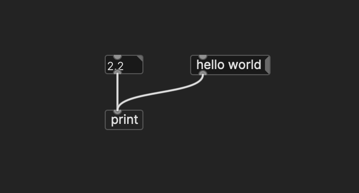 

Beyond these basic types, look for the add object icon at the top of the window—this includes some interface elements. Foremost among these is the "bang" -- select it from the menu, and then move it around on the screen. Connect it to the inlets on both the Number box and the Message box:

  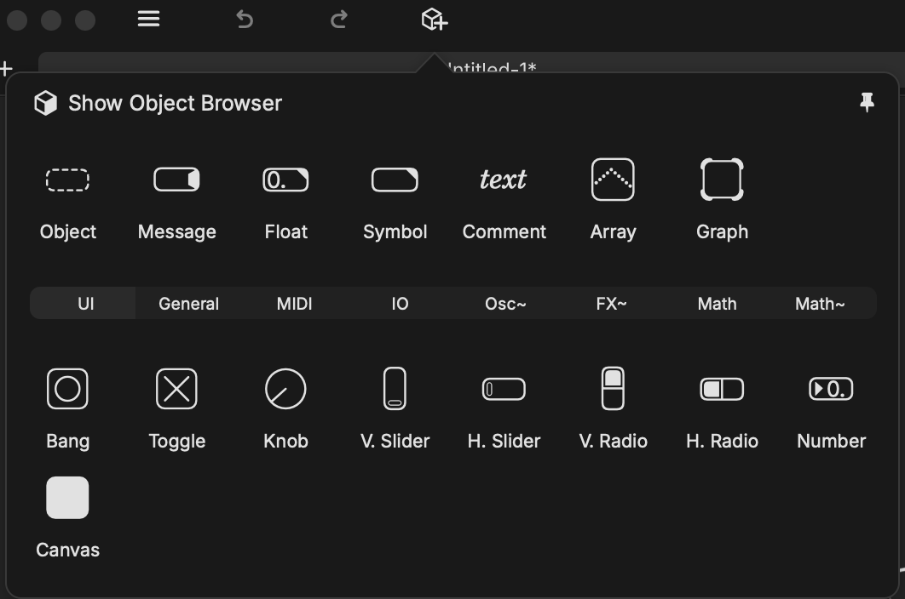 

  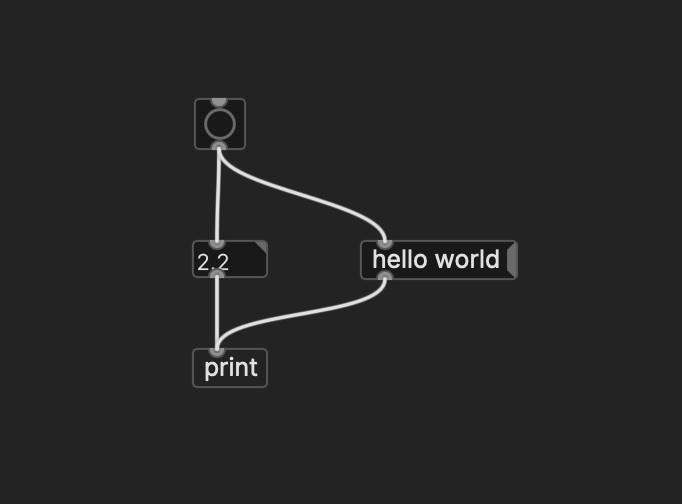 

In playback mode, clicking on the "bang" will send both the number and the "hello world" message to `print`, and hence to the log.

You can think of bangs, numbers, and messages as  discrete pieces of data that travel once along the connections only when they are triggered. These are all understood as "control messages" in Pd parlance.

Change into edit mode, drag a rectangle around all your objects, and hit delete—now we once again have a blank patch. Make a `bang` connected to two Number boxes, connect each of those to a `+` box (by typing "+" into an empty object), and finally connect that to another Number.

In playback mode, enter some numbers into the top two Number boxes, and hit the bang, you'll see the result. This demonstrates how data flows downward and can be operated upon along the way.

  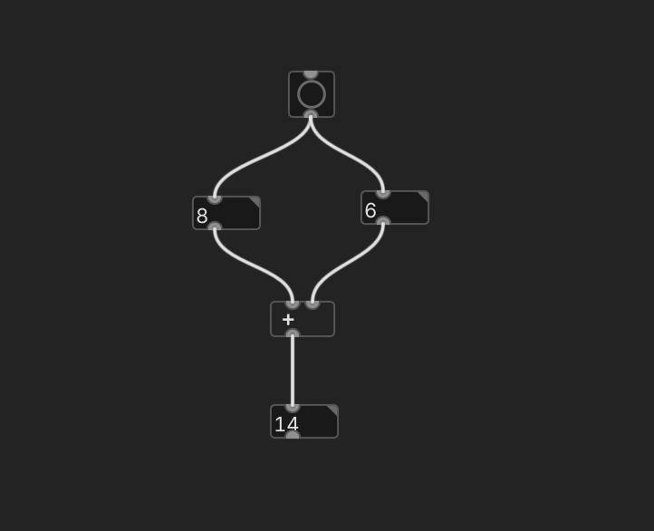 

Note that if you change the number in the left Number box, the result updates, but not if you change the number in the right Number box. In Pd, only a change or a bang in the left inlet triggers the operation.

Instead of always using both inlets, you can add a default value as a parameter of operator objects like `+` and `*`:

  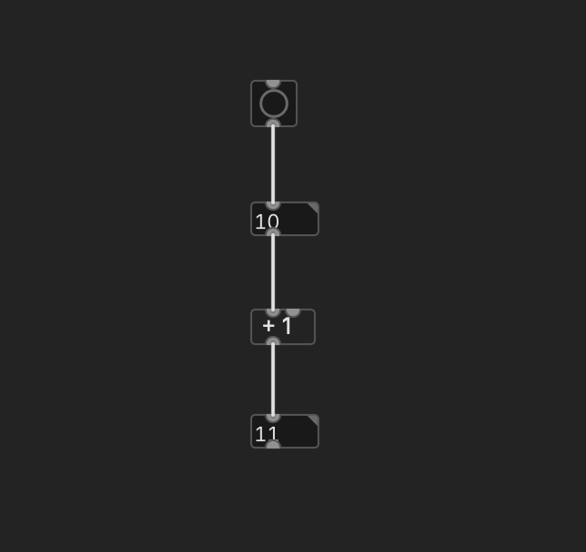 

### Audio signals

Audio signals flow a little differently than messages, because they are continuous—if there is a connection between two audio objects, data is always flowing.

What is an audio object? We know that an object handles audio if its name ends in a tilde ("~").

Add an object box to a new patch, and type `osc~`. This is a sine-wave oscillator.

  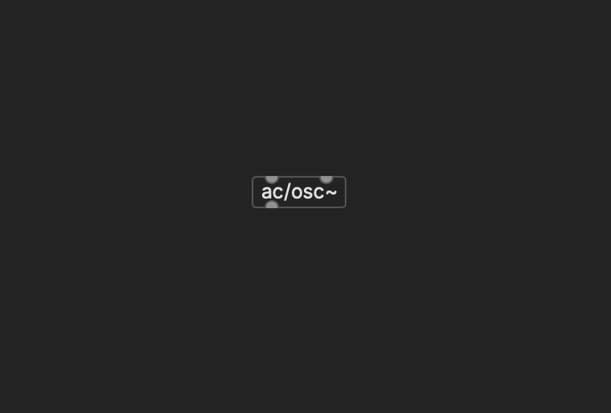 

Next, connect a number box upstream to both inlets of an `ac/output~` object downstream (the two inlets are for the right and left channels). Note that you can distinguish audio connections from control connections by their dashed lines. `ac/output~` is a digital analog converter—it will make our signal into sound. It has a volume control, a mute button, and it also lets you record a wave file: click the checkbox on to start recording, and again to turn it off (note that you will see warnings on the side that `writesf~` and `savepanel` are not supported in Compiled Mode—this is ok for our purposes).

Now, in playback mode, increase the value of the number box to 300 or so, and you should hear a "pure" synthesized tone.

  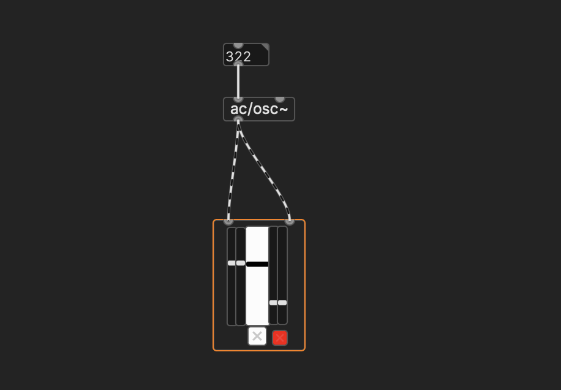 

Let's get a better sense of what's going on here by making a visual output as well. Create a `ac/scope~` object (which is one of the externals we added at the beginning).

You may have to arrange things a bit to get everything to fit. Switch into playback mode and make sure audio/DSP is on, and you should see the waveform graphed on the screen.

  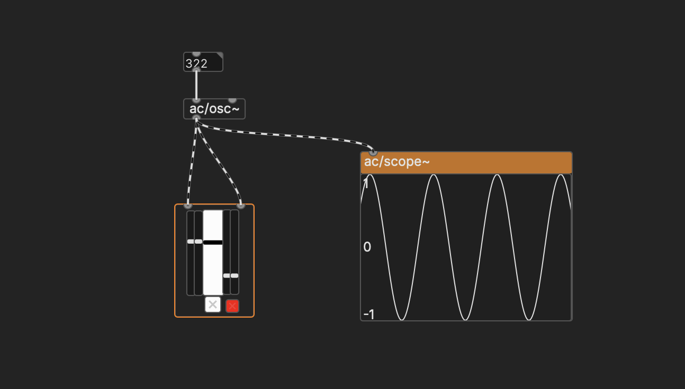 

One final addition, use the object panel to add a horizontal slider leading into the Number box to make it easier to control.

If you click the slider, you will see a panel that sets various properties. Set the range of the slider to 50–1000, which is a reasonable range for the fundamental frequencies that we might want to hear. Change the "lin" parameter to "log" -- frequency works logarithmically, and we want the slider to reflect that.

  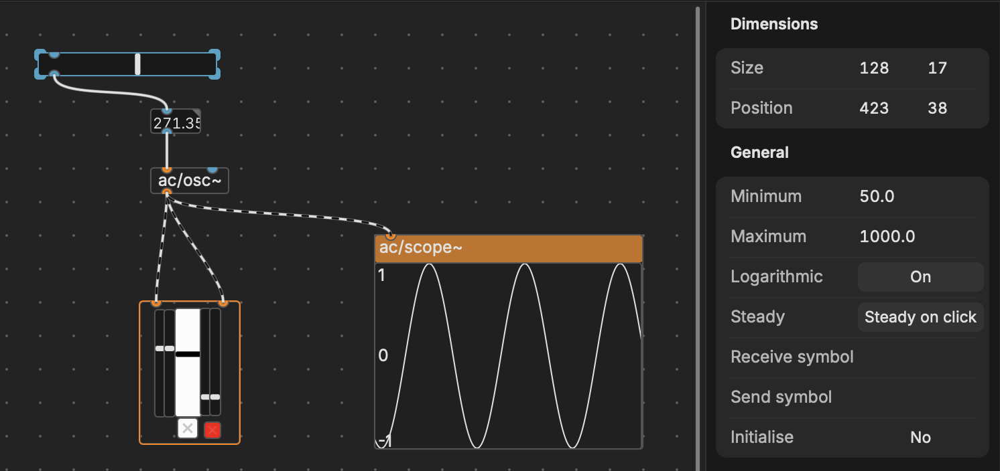 

Congratulations, you've made your first synthesizer! (Now make sure to save it).

## Seeing how the sausage is made

One final note: try Option-clicking on an object. If you're in playback mode, it may open up a patch that shows the _contents_ of the object—objects are made of other objects! If you're in edit mode, it may open up a helpfile that explains how to use it. These two features are very valuable as you get comfortable with how Pd works.