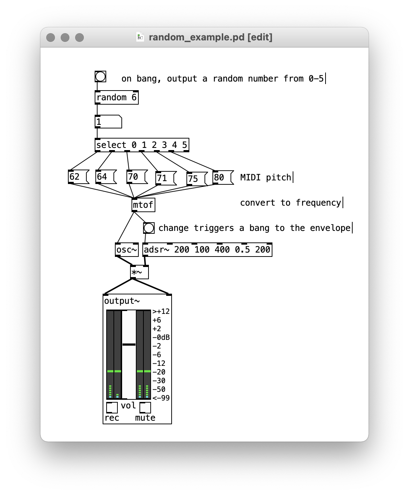
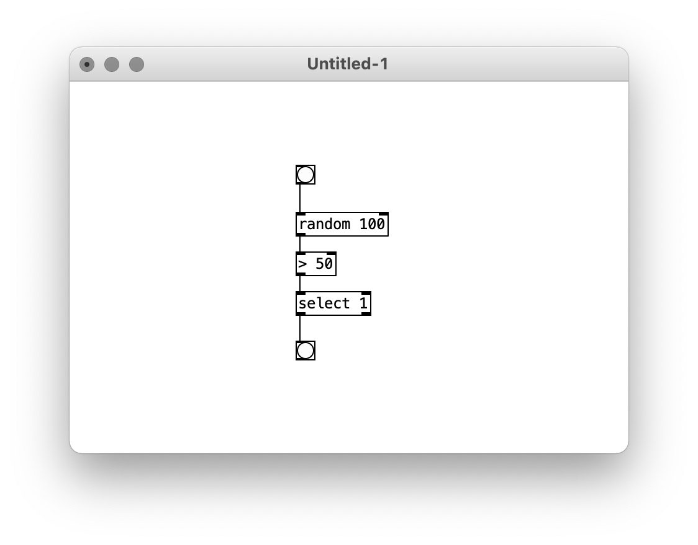
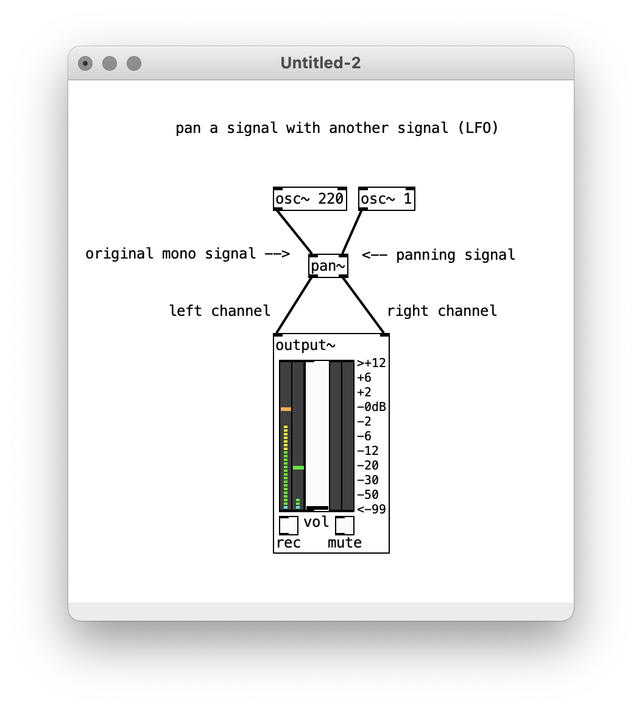
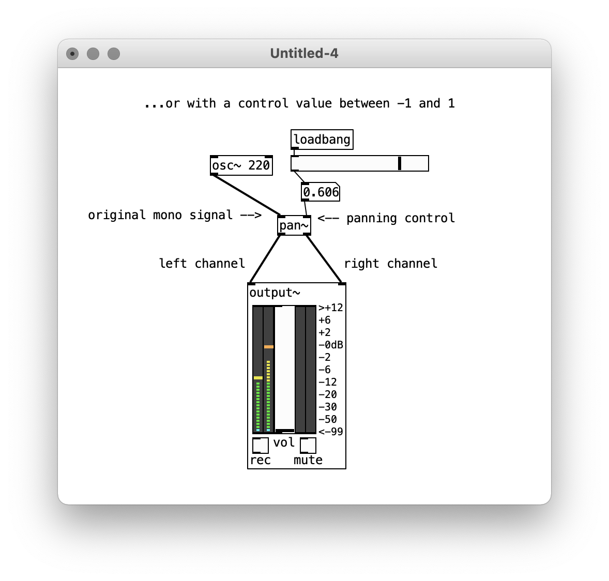
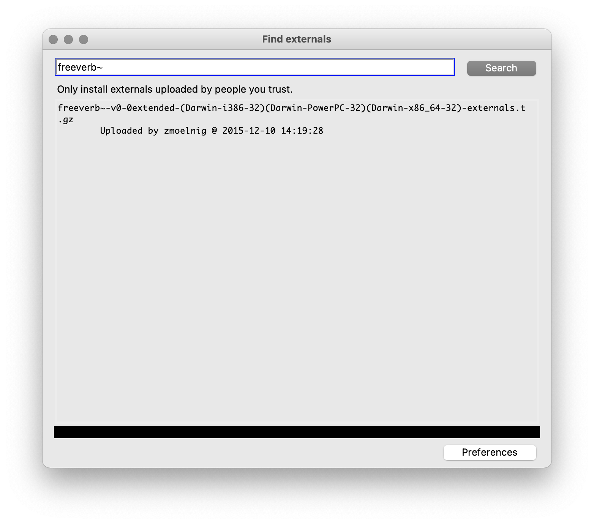
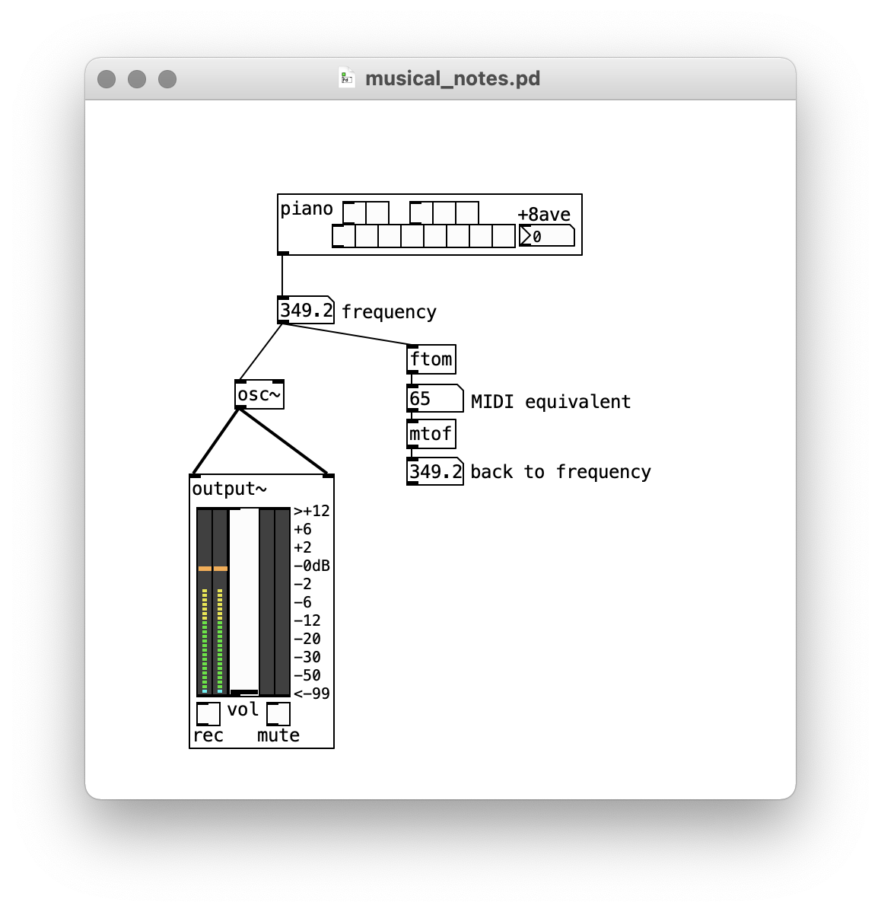

# Sequencing (and Spatialization)

Now that we know how to create rich sonic material with Pd, we're going to explore how we can structure those sounds over time.

## Delay

Envelopes give us the notion of an "event" in time that can be triggered. As we've already seen, in Pd, a "bang" is what makes things happen. There's a lot we can do with bangs, but to start off, we can delay them. Like this:

   

The number in `del` tells us how long the delay will be. In this case, it's 1000 milliseconds—or one second. 

Remember that there are two types of signals in Pd. So far, we've mainly been working with audio signals—the stuff that comes out of oscillators. But we've sent a few messages and used loadbang too—these aren't audio, they're "control" signals that tell Pd what to do. Audio objects are, of course, concerned with time, in the sense of building up audio waveforms. But `del` is the first object to demonstrate that control signals have a different notion of time, which functions to cue different things to happen when we want them to.

## Pulsation

Perhaps the most important object for sequencing is `metro` aka "metronome". `metro` outputs a bang every N milliseconds. To start a `metro`, we have to send it a 1, and to stop it, we send a 0. An easy way to do this is with a toggle object (both bangs and toggles are available from the object menu, or by typing "bng" or "tgl" respectively in an object box):

   

## Stepping

To take things a step further, we can add a counter. This object will count the number of bangs it receives, up to but not including the parameter given as a default value or sent to its right inlet.

   

A more interesting display than a number box is HRadio, which is available from the object menu. Since my counter goes to 10, I've had to go into the properties on the HRadio and increase the number of cells from the default 8.

   

Next, we add a `select` object. `select` compares an input to its inlet with the numbers or symbols given to it as parameters. If the input matches one of them, the corresponding outlet gets a bang. (Note that the final outlet on `select` is just the input if the input doesn't match any of the specified options).

Since our counter has 10 steps, it outputs values from 0 to 9. `select` takes that number, and bangs the appropriate step.

   

From here, we could connect those bangs to envelope generators to play sounds.

Here's a simple drum machine to show how that might look:

   

Alternately, a sequencer could control the number values of oscillating frequencies. If we want those to align with standard musical tuning (12 TET), we can use the mtof

Note that `counter` outputs a bang from its right outlet every time it has finished the count and is starting over. This means you can chain counters together to have different levels of repeating events:

   

## Random and comparison operators

Beyond `metro`, `counter`, and `select`, a very useful object for sequencing is `random`. When `random` receives a bang in its left inlet, it outputs a random number less than the default parameter or a message sent to its right inlet.

Combined with `select`, this is an easy way to choose between several options on a bang. For example, this plays one of six pitches with each bang:

   

`random` can also be used to introduce indeterminacy. For example, maybe a certain sound is only triggered 50% of the time:

   

Note that this example uses another new object, `>` which outputs a 1 if it receives a number greater than its argument. We can then select on the output of `>` to get a bang that only fires half of the time.

Other comparison operator objects are: `<`, `<=`, `>=`, and `==` (note the double).

(Actually, the above example should be >=, shouldn't it?)

## Spatialization

In Audacity, we explored amplitude envelopes, stereo panning, and reverb as the fundamental tools of spatialization. The same applies with Pd. We've already seen how to apply amplitude envelopes as well as "mix" sounds by dividing or multiplying their output by a number to decrease or increase their  amplitude.

Regarding stereo, note that the `dac~` object, as well as the `output~` object that we've been using, has two inlets, one each for the right and left channel. By connecting signals only to one or the other, we can pan them hard left or hard right.

...but for more detailed control, we can use `pan~`. This object takes either a continually varying signal (aka an LFO) or a control value, and routes a mono input to stereo output, adjusting the balance between channels accordingly.

   

   

### Reverb

Pd does not have a reverb object by default. Reverb can be programmed in Pd, but it is not a simple affair. Better to use an object programmed for us in a more low-level language, like C.

Many people and communities have made additional objects and libraries for Pd that can be downloaded—these are called "externals" and can be made in Pd or in C. To install a reverb, go to the "Help" menu, choose "Find externals", and type "freeverb~", which is the name of a very good (and very free) reverb object.

   

You'll see a version of `freeverb~` that is specific to your operating system (unlike objects made in Pd, objects programmed in C cannot simply be copied to another computer, they have to be built specifically for your computer's architecture). Click on the first entry (there may be only one) and Pd will install it. You'll see a new folder inside your "Pd" -> "externals" folder, and you'll also be able to type `freeverb~` in your patch.

Look at `freeverb~`'s help file for details on how to use it. But at it's most basic, you simply hook the left channel to the left inlet, the right channel to the right inlet, stereo output, and away you go:

   

I recommend using only one `freeverb~` object as the very last object before `dac~` or `output~`. More than one will be a burden on your CPU, and with just one you will have a coherent sense of spatialization.

## Using musical pitches

Though no music theory is required here, if you want to use musical notes (even-temperment), Pd can convert to MIDI pitch numbers to frequencies and back. MIDI pitches are just the notes of an even-tempered piano labeled from 0–127. `mtof` converts this number to a frequency, and `ftom` converts it back.

I also made an object called piano to help you determine those pitches, or just to connect and fool around with notes.

If you want to use just-intonation or microtonal systems ... you'll have to program it yourself.

   

