# Synthesis

Let's explore how to create waveforms with Pd.

## Oscillators

All synthesis starts with oscillators. `ac/osc~` is a perfect sine wave that oscillates between -1 and 1. We can also write it as `ac/osc~ sin`. However, there are other shapes that we can use: try `ac/osc~ tri`, `ac/osc~ saw`, `ac/osc~ sqr` in your patch and play with the results.

  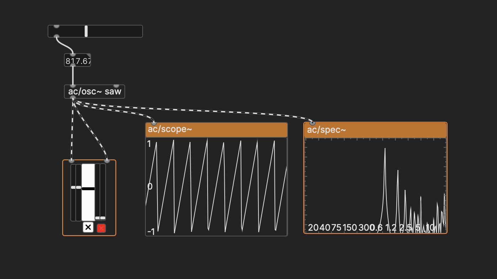 

With one oscillator, we're limited to fairly simple tones. But by combining oscillations together in different ways, we can get infinitely complex sounds. The classic techniques used for this are called "additive", "AM", "FM", and "subtractive" synthesis.

## Additive Synthesis

When simple oscillators are added together, they become the building blocks of much more complex waveforms.

Using the `+~` object (notice the tilde, which indicates that we are adding audio signals, not numbers), multiple oscillators can be combined. Because this also increases the amplitude of the waveform, we need to divide by the number of signals we are adding.

  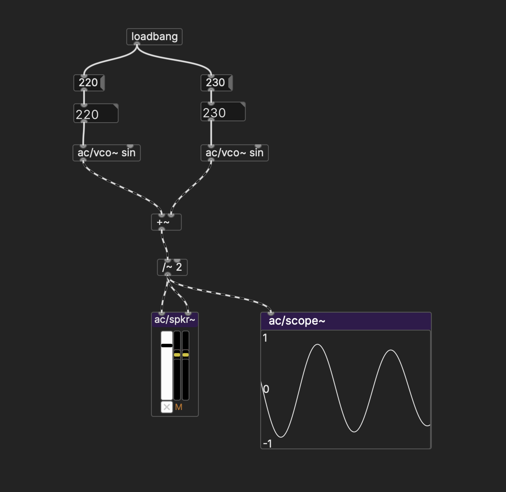 

Try making two oscillators with very close frequencies—you'll hear "beating", which is another, implicit oscillation at a frequency that is the difference between the two initial frequencies. Note that dragging on the number boxes in playback mode will increase or decrease by an integer value, but holding shift down will move the decimals.

## AM Synthesis and LFOs

Similarly, multiplication (`*~`) creates even wilder waveforms—in this case, we don't hear one of the oscillators directly, but it is modulationg the amplitude (volume) of the other oscillator. For this, we'll use `ac/lfo~ saw`—"LFO" stands for low-frequency oscillator, but there is really no difference between `ac/osc~` and `ac/lfo~` except instead of moving between the full signal range of -1 to 1, it oscillates between 0 to 1 (you can't have a negative amplitude). When multiplied with a signal from `ac/osc~`, this becomes an amplitude adjustment—from zero volume to full (1) volume.

  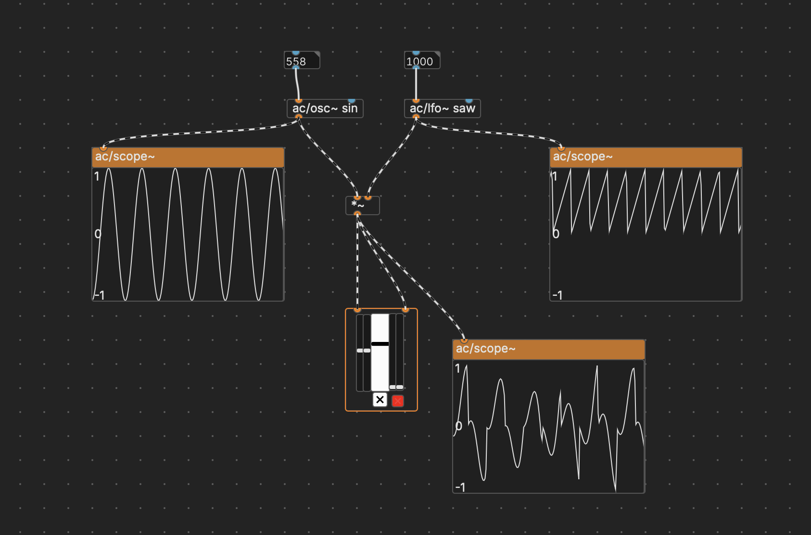 

If you set the LFO frequency under 100 Hz or so, you'll notice you get a pulsation effect. To smooth it out and make it into a "tremolo" instead, we can use `ac/lfo~ sin` as a modulator instead of `ac/lfo~ saw`. Like before, the signal moves between 0 and 1 instead of -1 and 1, but it does it with a sine shape instead of a sawtooth:

  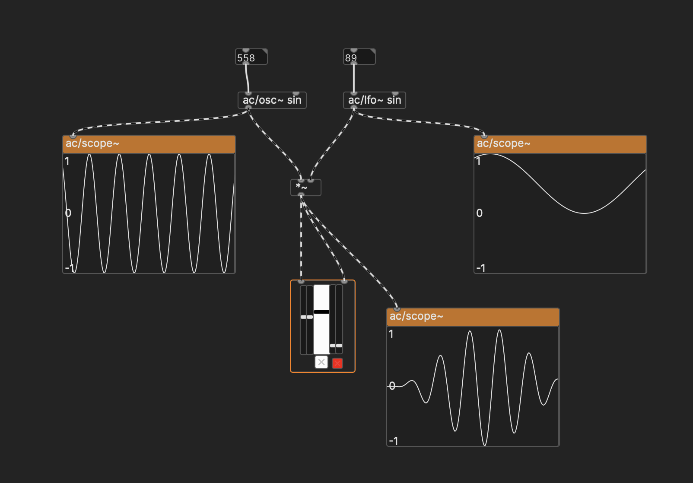 

In general, even though LFOs aren't heard directly, they can change the character of other sounds as well as be used to control larger changes in a patch over time (they are largely the basis of modular synthesizers).

## FM Synthesis

While AM synthesis changes the amplitude of another signal, Frequency Modulation (FM) synthesis changes the frequency instead. Thus far, we have used static values for the frequencies of our oscillators, other than varying them manually with a Number box or slider. However, we can have another oscillator drive this change automatically instead.

  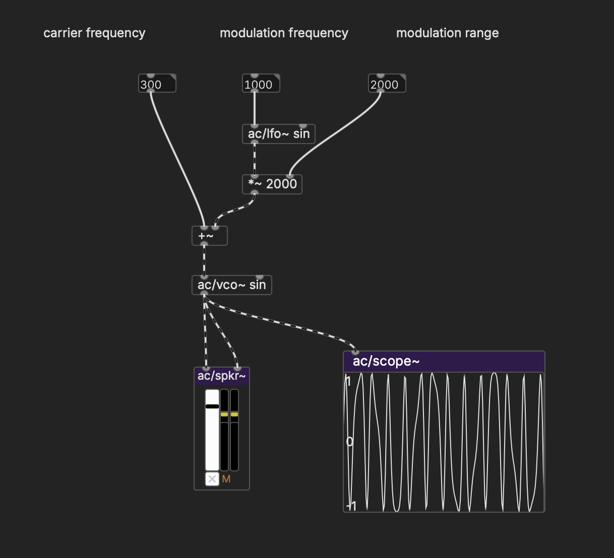 

Here, the frequency that we give to `ac/osc~ sin` is determined by another `ac/osc~ sin`. This second oscillator moves between -1 and 1 at 1000 times a second, which when multiplied by 2000 is between -2000 and 2000 at 1000 times a second. The frequency we give to the first oscillator thus becomes a center frequency around which the waveform rapidly oscillates. Varying these parameters results in complex waveforms.

## Subtractive Synthesis and Filters

There's another important "oscillator" that we've left out: `noise~`. Unlike the others, `noise~` produces random energy across the audio spectrum, aka "white noise":

  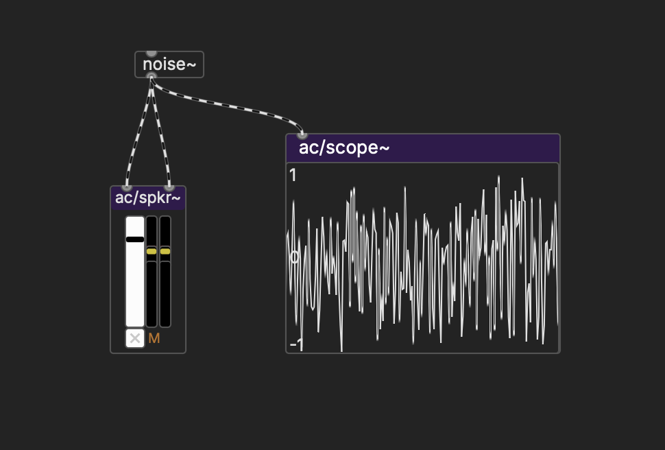 

`noise~` opens up the possibility of approaching synthesis from the opposite direction: instead of adding oscillators together to create complex sounds, what if we start from a maximally complex sound and _subtract_ frequencies to get what we want?

In order to do that, we'll need a **filter**. We are going to use an object called `ac/lop~`, which is a low-pass filter (meaning that it lets low frequencies through up to a "rolloff" frequency at which point it starts attenuating the signal).

To see what the filter is doing, we're going to use `ac/spec~` instead of a scope so that we can see what frequencies are present in the signal. 

  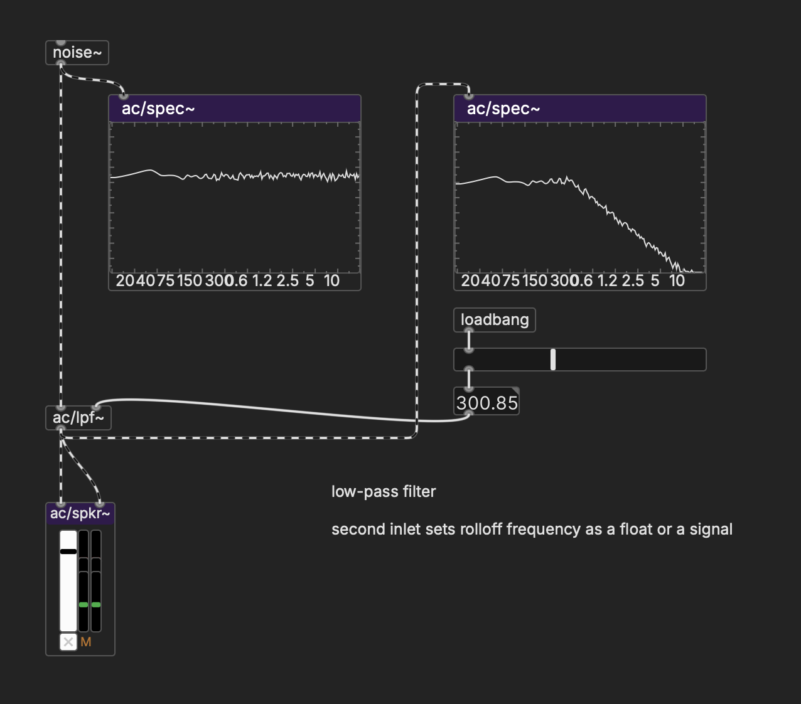 

(The slider in this example has a range of 20–20000, with log turned on)

Try replacing `noise~` with `ac/osc~ saw`—this is the setup that most hardware synthesizers use to generate their basic timbres. In this case, the filter is smoothing out the upper harmonics of the square wave in order to produce a more mild timbre.

  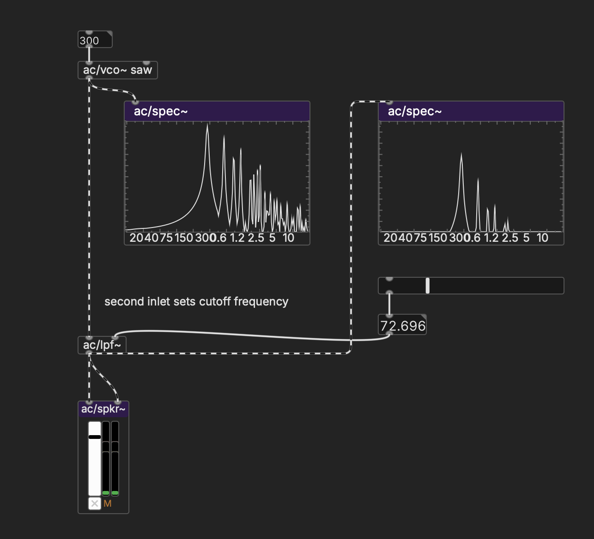 

## Distortion

With subtractive synthesis, we're taking a complex signal and filtering out the upper harmonics, making it smoother. But it is also possible to add harmonics back in—this is called, in order of intensity: "saturation", "overdrive", "distortion", or "fuzz".

Distortion happens in the analog world when a signal is too "hot" for the equipment and so the peaks and valleys of the amplitude curve get flattened out—imagine yelling into a microphone so loudly that the diaphragm can't move enough to capture the signal. In essense, this "squares off" the wave, which creates added harmonics, in the same way that a regular square wave has a richer sound than a sine oscillator.

One easy way to generation distortion in Pd is with `clip~`. Make an oscillator, and send it into a `*~` object that will function as a "gain". Multiply the signal by something greater than 1 so that it falls outside of signal range. Now add a `clip~` with arguments at -.9 and .9. You'll see how the signal gets chopped off, which adds the richer harmonics.

  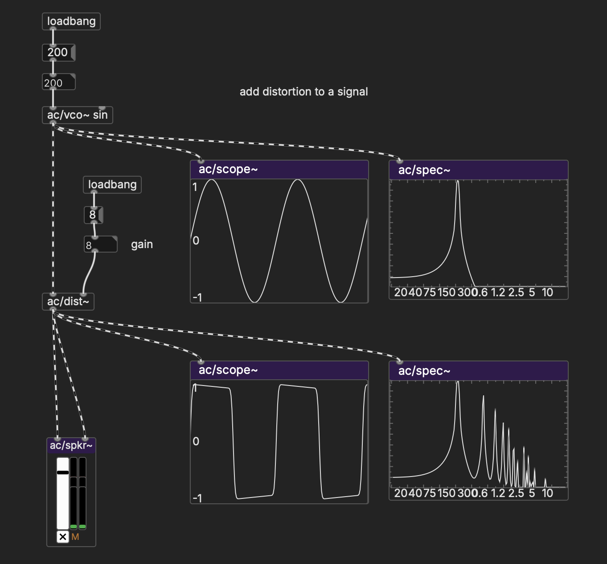 

This way of doing things doesn't sound that great, however, because it has such an abrupt cutoff. `ac/dist~` does essential the same thing, but it rounds off the bend a bit, which is more pleasing to the ear, and more like how things work in the analog domain.

  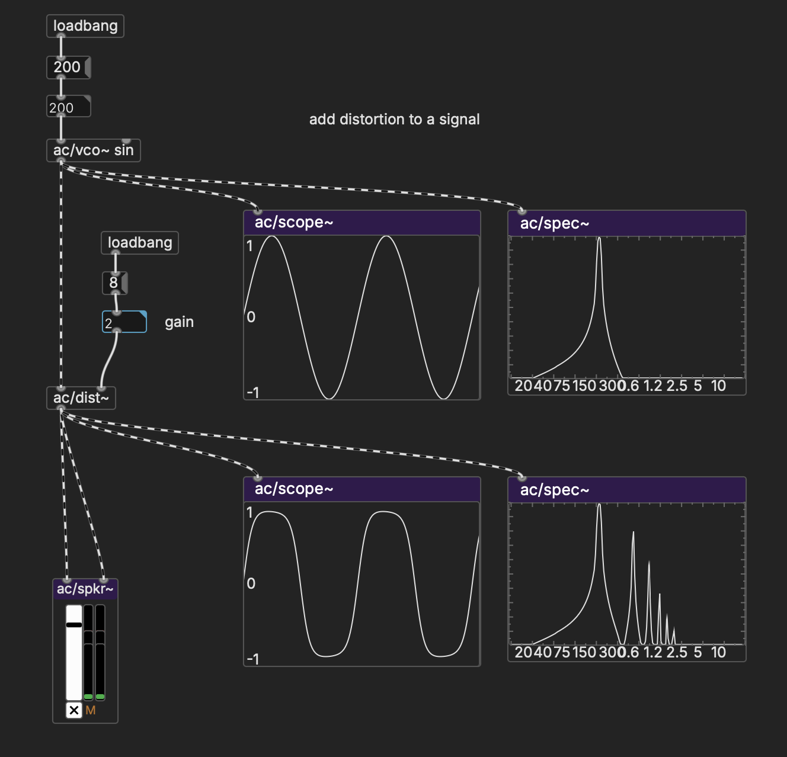 

## Complex oscillators

Note that this becomes a branching process: any number box can be replaced with another oscillator of some kind, whether it serves as a frequency modulator, an amplitude modulator, or to modulate the rolloff frequency of a filter. Combined, you can produce some dynamic sounds.

  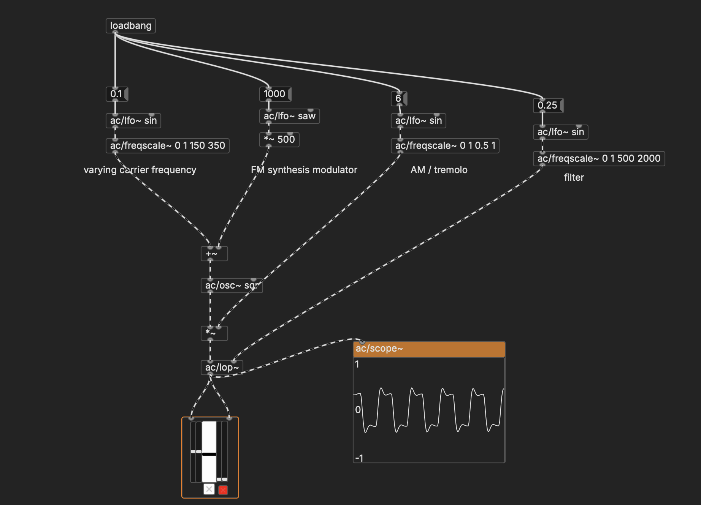 

Notice how we can use `freqscale~` to change the 0 to 1 range of an LFO to an arbitrary range of frequencies, in this case 150–350 and 500–2000. `freqscale~` uses a logarithmic scale, because we perceive doubling of a frequency as a linear change of one octave.

